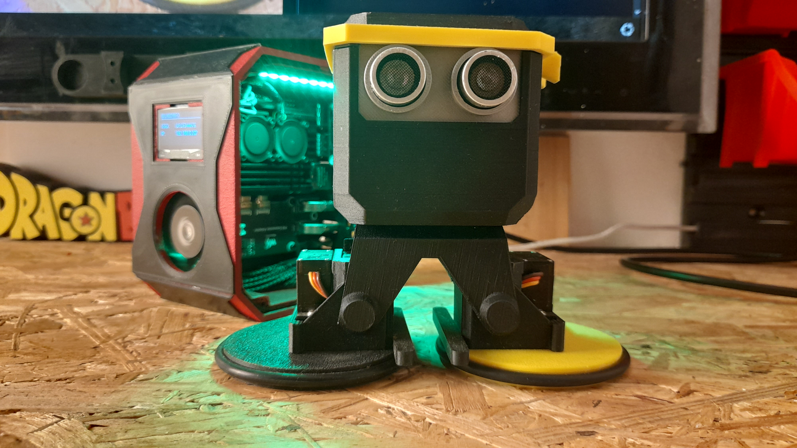
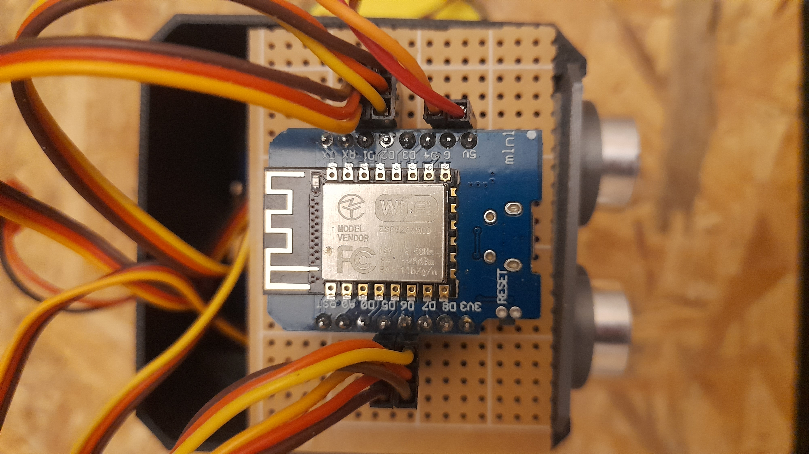
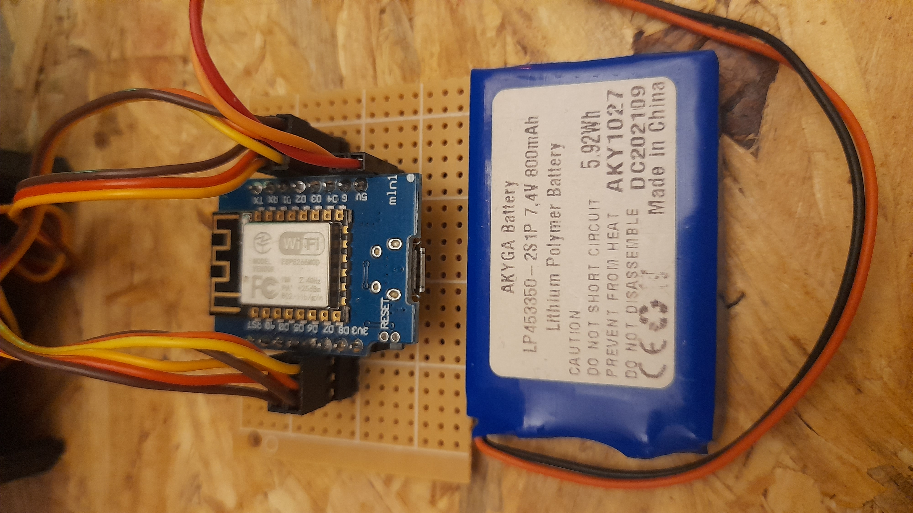
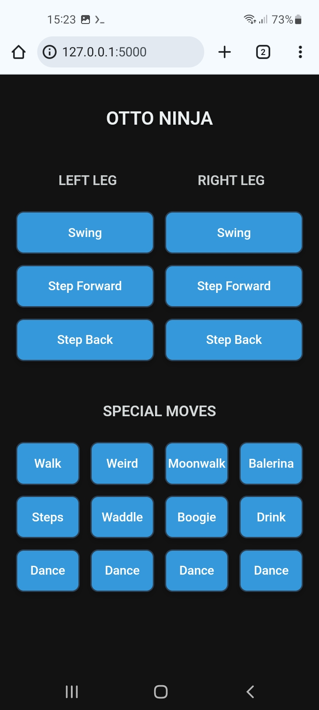

# Otto Ninja Diy WiFi-Controlled Robot (ESP8266 + Python)

A compact bipedal robot powered by **ESP8266 (Wemos D1 Mini)** and controlled via WiFi using **Python**.



## Features

- **Access Point** — ESP8266 creates its own WiFi hotspot for direct connection
- **WiFi Control (UDP)** — Operate the robot from any device running Linux/Python on the same network.
- **Python API** — Easy-to-use control functions for motion and behavior.
- **Simple Wiring** — Minimalistic setup using 4 servos.

## Project concept

The core idea behind this project is to offload all servo control to the ESP8266, while keeping the entire decision-making and logic layer in Python.

This architecture brings a few key benefits:

⚡ Fast development – You can modify and test your Python logic instantly, without reflashing the microcontroller.

Separation of concerns – The ESP8266 acts purely as a low-level actuator controller (“muscles”), while Python handles the higher-level behavior and intelligence (“brain”).

Flexible updates – All changes to walking patterns, movement sequences, or reactions can be done from the Python side.

Think of it as:
Wemos = Muscles, 
Python = Brain

## Inspiration and Basis of This Project

This project is based on the original [OttoNinja](https://github.com/OttoDIY/OttoNinja) by OttoDIY.  
I deeply admire the original author for the incredible amount of work and dedication put into that project.

My repository builds upon and customizes those solutions, using the ESP8266 and a custom Wi-Fi servo control implementation.

Many thanks to the original creators for the inspiration and excellent foundation!


## Disclaimer

⚠️ I’m just a hobbyist and self-taught developer. This project is a personal experiment and learning journey, so please keep in mind that the code and design might not follow professional standards. Use it as inspiration or a starting point rather than a polished, production-ready solution.

## Hardware Setup

| Component   | Description                              |
|------------|------------------------------------------|
| Controller | Wemos D1 Mini (ESP8266)                  |
| Servos     | 2x Positional (LL, RL), 2x Continuous (LF, RF) |
| Power      | 5V                                       |

## Wiring Diagram

| Servo | ESP8266 Pin |
|-------|-------------|
| LL    | D1          |
| LF    | D2          |
| RL    | D5          |
| RF    | D6          |





## 🎬 Installation Demo Video

You can watch the full step-by-step setup and live demo here:  
[](https://youtube.com/shorts/ZdJvOfch9kk)


## Installation

### 1. Flash ESP8266 Firmware

- Install [Arduino IDE](https://www.arduino.cc/en/software)
- Add **ESP8266 support** via the Boards Manager (search for "ESP8266")
- Open the sketch from this repo:  
  [OttoNinjaServoDriverESP](https://github.com/boryspimpek/OttoNinjaServoDriverESP)

- Upload the code to your Wemos D1 Mini
---

### 2. Python Control Script

Clone the Python control repository:

```bash
git clone https://github.com/boryspimpek/OttoNinjaServoDriver.git
```

```bash
cd OttoNinjaServoDriver
```

#### Recommended: Use a virtual environment

To avoid conflicts with other Python packages, it's recommended to use a virtual environment:

```bash
python3 -m venv venv
```

- Activate the environment: On Linux/macOS:
```bash
source venv/bin/activate
```

- Activate the environment: On Windows:
```bash
venv\Scripts\activate
```

Install required dependencies:

```bash
pip install -r requirements.txt
```

- Connect to 'OttoNinja' - your Otto Ninja's WiFi access point.
- Password is: 12345678

- Run the web control interface:

```bash
python3 app.py
```

Open your browser and navigate to:  
[http://127.0.0.1:5000](http://127.0.0.1:5000)

## Default Controll Panel



## Running on Android (Termux)

You can also run the Python control script on your Android phone using [Termux](https://termux.dev/en/):

1. Install Termux from F-Droid or Google Play.
2. In Termux, install Python:
   ```bash
   pkg install python
   ```
3. Clone this repository and follow the standard installation steps.

## Project Structure

```
OttoNinjaServoDriver/
├── app.py                # Flask server – connects Python logic with the web panel, handles HTTP requests
├── servo.py              # Here you define all robot movement and sequence functions (e.g. walk, dance, moonwalk)
├── static/
│   └── js/
│       └── main.js       # JavaScript script handling interactions on the page (e.g. sending requests when buttons are clicked)
├── templates/
│   └── index.html        # Web page – robot control panel; you can add new buttons here for additional actions
├── requirements.txt      # List of required Python libraries
└── README.md
```

- **servo.py** – define all robot movement and sequence functions here. Every new movement or behavior should be implemented as a separate function in this file.
- **app.py** – Flask server that provides the web panel and maps buttons on the page to the appropriate functions from `servo.py`.
- **templates/index.html** – robot control panel accessible via browser. You can add new buttons here to trigger new actions.
- **static/js/main.js** – handles browser-side logic, e.g. sending requests to the server when buttons are clicked.

---

## License

This project is a derivative of [OttoNinja](https://github.com/OttoDIY/OttoNinja) by [OttoDIY](https://www.ottodiy.com) and Sebastian Coddington.  
It is licensed under the [Creative Commons Attribution-ShareAlike 4.0 International License](https://creativecommons.org/licenses/by-sa/4.0/).

You are free to use, modify, and redistribute this work, as long as:
- You give appropriate credit to the original authors.
- You include a link to the [Otto DIY website](https://www.ottodiy.com) in any redistribution.
- Any remixes or adaptations are released under the same CC-BY-SA license.

